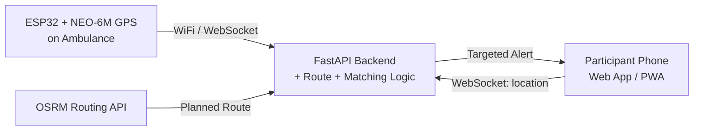
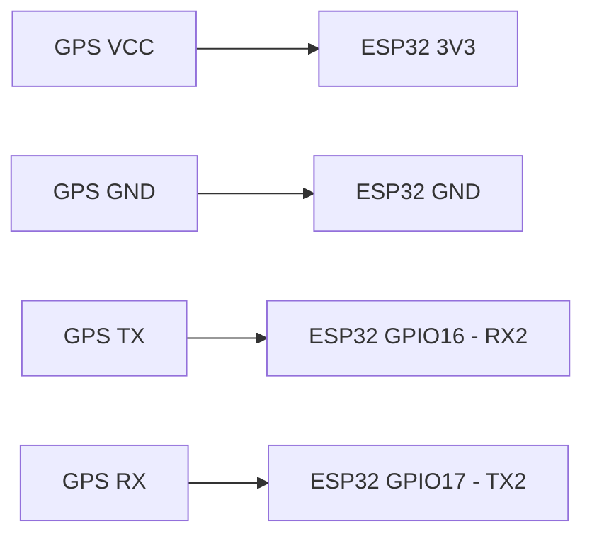
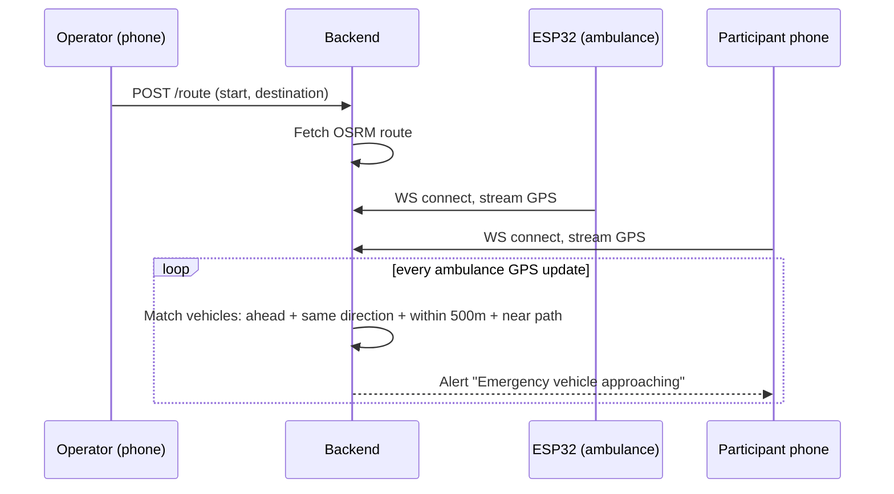

# mini-project
mini-project


   

# Lane-Aware Intelligent Emergency Vehicle Alert System

A build guide for the low-cost prototype described in Proposition No. 4: an ESP32 + GPS ambulance unit, a FastAPI/WebSocket cloud backend, and a browser-based participant app that warns only the vehicles that are actually ahead of the ambulance on its route.

This guide takes you from an empty breadboard to a working demo.

---

## 1. System Architecture



**Flow summary**

1. Ambulance operator enters start and destination on the operator web page.
2. Backend fetches a route polyline from OSRM.
3. ESP32 streams live GPS fixes to the backend over WebSocket.
4. Participant phones stream their own GPS fixes to the backend.
5. Backend checks each participant against the route: ahead, same direction, within the configured warning distance (500 m default), and close to the path.
6. Only matching vehicles receive a push-style alert over their open WebSocket connection.

---

## 2. Hardware Build

### 2.1 Bill of Materials

| Component | Qty | Notes |
|---|---|---|
| ESP32 DevKit (WiFi) | 1 | Any standard 30/38-pin DevKitC board |
| NEO-6M GPS module | 1 | With ceramic antenna |
| Breadboard | 1 | Half+ size |
| Jumper wires (M-M) | ~8 | |
| USB cable + power bank | 1 | 5V, ESP32 power |
| Android phone (operator) | 1 | Provides WiFi hotspot |
| Android/any phone (participant) | 1+ | Optional, for demo |

### 2.2 Wiring (NEO-6M → ESP32)



<details>
<summary>Wiring notes</summary>

- Use ESP32 Hardware Serial 2 (`Serial2`, pins 16/17) so `Serial` stays free for USB debug output.
- Most NEO-6M breakout boards run fine on 3.3V; check your specific module's silkscreen before wiring to 5V.
- Give the GPS module a clear view of the sky (near a window) for the first fix — cold start can take 30–60 seconds.
</details>

---

## 3. Software Stack

| Layer | Technology |
|---|---|
| Firmware | Arduino/PlatformIO, C++, TinyGPS++, WebSocketsClient |
| Backend | Python, FastAPI, WebSockets, geopy-style haversine math |
| Routing | OSRM public demo server (or self-hosted) |
| Participant client | Plain HTML/JS PWA using browser Geolocation API |

Project layout produced by this guide:

```
lane-aware-eva/
├── firmware/ambulance_esp32/ambulance_esp32.ino
├── backend/main.py
├── backend/requirements.txt
└── frontend/index.html
```

---

## 4. Backend Setup

<details>
<summary>Install & run</summary>

```bash
cd backend
python3 -m venv venv
source venv/bin/activate        # Windows: venv\Scripts\activate
pip install -r requirements.txt
uvicorn main:app --host 0.0.0.0 --port 8000 --reload
```

Find your machine's LAN IP (`ipconfig` / `ifconfig`) — the ESP32 and phones will connect to `ws://<your-ip>:8000/...`.
</details>

**Endpoints**

| Endpoint | Direction | Purpose |
|---|---|---|
| `POST /route` | operator → backend | Set start/destination, fetch OSRM route |
| `WS /ws/ambulance` | ESP32 ↔ backend | Stream ambulance lat/lng/speed/heading |
| `WS /ws/vehicle/{vehicle_id}` | phone ↔ backend | Stream vehicle location, receive alerts |
| `GET /status` | debug | Current ambulance state + route |

See `backend/main.py` for the full implementation, including the vehicle-matching logic (ahead / same-direction / within-corridor / within-500m checks).

---

## 5. Firmware Setup

<details>
<summary>Arduino IDE setup</summary>

1. Install ESP32 board support: **File → Preferences → Additional Board URLs** → add
   `https://raw.githubusercontent.com/espressif/arduino-esp32/gh-pages/package_esp32_index.json`
2. **Tools → Board → ESP32 Dev Module**
3. Install libraries via Library Manager:
   - `TinyGPSPlus` (Mikal Hart)
   - `WebSockets` (Markus Sattler / Links2004)
   - `ArduinoJson`
4. Open `firmware/ambulance_esp32/ambulance_esp32.ino`, edit the `WIFI_SSID`, `WIFI_PASS`, and `WS_HOST` constants at the top.
5. Connect the ESP32 to your ambulance operator phone's hotspot (or same network as your backend for bench testing).
6. Upload, then open Serial Monitor at 115200 baud to confirm GPS fixes and WebSocket connection.

</details>

---

## 6. Participant App Setup

`frontend/index.html` is a single-file page — no build step needed.

1. Edit the `WS_HOST` constant near the top of the file to your backend's LAN IP.
2. Serve it over the network so phones can reach it, e.g.:
   ```bash
   cd frontend
   python3 -m http.server 8080
   ```
3. On a phone, browse to `http://<your-ip>:8080` and tap **Start Sharing Location**.
4. Grant location permission. HTTPS is normally required for Geolocation on mobile browsers — for a LAN demo, `http://` on the same WiFi network works on most Android browsers; if not, tunnel with `ngrok` or similar.

---

## 7. Demo / Test Workflow



**Suggested demo script**

1. Start backend, note LAN IP.
2. Set a short walking/driving route via `POST /route`.
3. Power up the ESP32 near a window, confirm it streams fixes (Serial Monitor + `/status`).
4. Open the participant page on 2–3 phones at different points along and off the route.
5. Walk/drive the ESP32 unit along the route and confirm only the phone(s) ahead and on-path receive the alert, and that it stops when they're passed or off-route.

---

## 8. Configuration Reference

| Setting | Default | Where |
|---|---|---|
| Warning distance | 500 m | `backend/main.py` → `WARNING_DISTANCE_M` |
| Path corridor width | 30 m | `backend/main.py` → `CORRIDOR_WIDTH_M` |
| GPS send interval | 2 s | firmware `SEND_INTERVAL_MS`, frontend `WATCH_INTERVAL_MS` |
| Bearing tolerance | ±45° | `backend/main.py` → `BEARING_TOLERANCE_DEG` |

---

## 9. Known Limitations (carry these into your report)

- Phone-grade GPS is not lane-accurate; the "lane/path" selection is a corridor-distance approximation, not true lane detection.
- Single ESP32/GPS unit — no redundancy, no LoRa fallback if WiFi hotspot drops.
- OSRM public demo server has rate limits; for repeated testing, consider self-hosting OSRM or caching routes.
- This is an academic demonstration and does not replace sirens, traffic law, or certified emergency-vehicle systems.

---

## 10. Suggested Next Steps

- Log matched-alert events with timestamps for your evaluation section (false positive / false negative rate).
- Add a simple map view (Leaflet + OpenStreetMap tiles) to the operator and participant pages to visualize ambulance position and route live.
- If time permits, replace the corridor-distance heuristic with point-to-polyline projection for tighter path matching.
